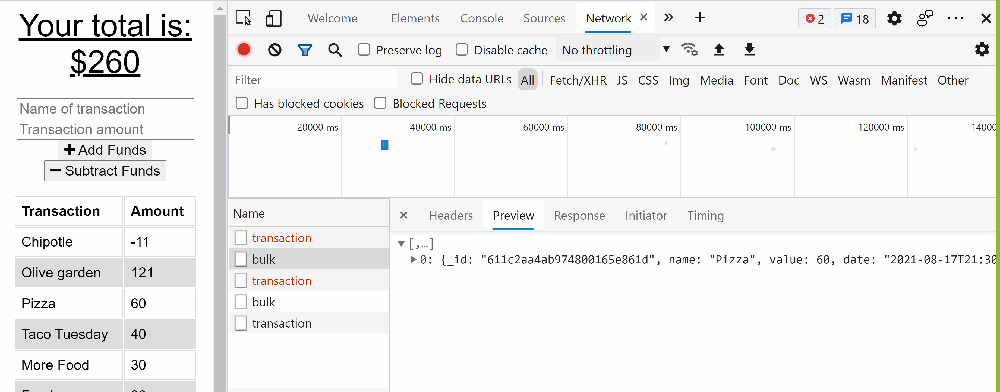

# bonang_budgetTracker

## Budget Tracker 

# Developer's Profile
[GitHub](https://github.com/csbonang)
 
## Description 
-------------------
The budget tracker allows the user to add expenses and deposits to their budget with or without a connection. When entering transactions offline, offline entries should be added to the tracker. 

To complete this task, the following was used: 
1. service-worker
2. manifest
3. indexdb
## Table of Content
-------------------
* [Heroku](#heroku)
* [Commands](#commands)
* [Screenshot](#screenshot)
* [License](#license)
* [References](#references)
* [Questions](#questions)

## Heroku
Deployed Link: https://vast-springs-09222.herokuapp.com/  

## Commands
npm start

## Screenshot
<b>Image displays budget tracker working online and offline</b>  

## License 
[MIT License](https://opensource.org/licenses/MIT)

## References
Unit 18, mini project
Unit 19, activity 9-12

## Questions 
If you have any questions about the repo, open an issue or contact me directly
at csgbonang@gmail.com. You can find more at [csbonang](https://github.com/csbonang). 
        